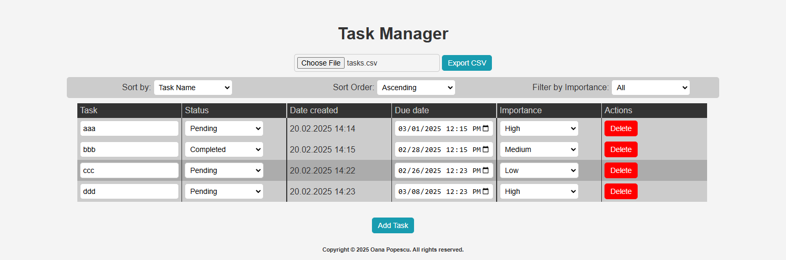

# task manager
A task manager that uses HTML, CSS and Vanilla Javascript to create a task manager when you can create, delete or update your task, export them as a CSV file or import existing CSV

## Screenshot
